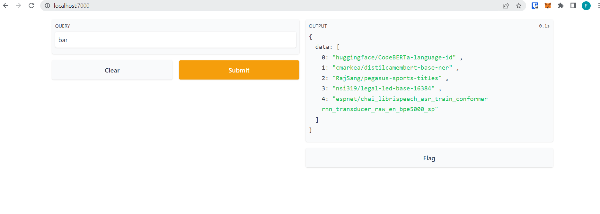
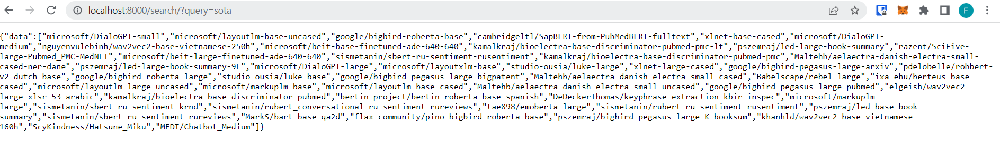
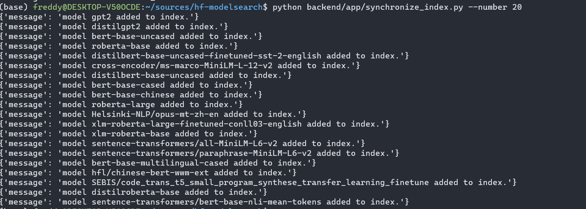

# Huggingface Model Search

REST API + gradio frontend for searching models in Huggingface model hub based on the contents of their README files.

# Getting started

1. Make sure you have docker installed
2. Make the directory to store the readmes: `mkdir es-data` followed by `chmod 777 es-data`
3. Run: `docker-compose up`
4. Run the synchronization script to populate the index with READMEs. `python backend/app/synchronize_index.py --number k`. `k` can be from `1` to `40,000`. I tried with `5,000`. This script should be able to run in any python 3.7+ environment since it doesn't have any external dependencies.
5. Search for models whose README contain `bert`, `curl -X 'GET' 'http://localhost:8000/search/?query=bert' -H 'accept: application/json'`
6. You can also visit the gradio front-end at `http://localhost:7000`
7. View the documentation at `http://localhost:8000/docs/`. Note that you can `POST` to `/model/` endpoint to manually add data to the index as well.

# Screenshots

### Gradio

### REST API

### Synchronize script

# Design

Model README contents are stored in a local elasticsearch cluster. The REST api is built with FastAPI. The contents of the elasticsearch cluster are synched manually by running the `backend/app/synchronize_index.py` script. 

## Why Elasticsearch?

I considered the following options for storing the READMEs:

1. A python dictionary mapping `model_id` to README content.
2. A sqlite/postgres database with full text search addons
3. An Elasticsearch cluster

Despite being the quickest to implement, I didn't think option 1 was a good choice because it would not consume a lot of memory as the number of indexed models increased. It would also require implementing our own search algorithm which would be possible for the scoped-down requirements of this exercise but would likely not be feasible if we wanted to implement boolean logic, e.g. `contains:text and not contains:bert`.

Option 2 and 3 are the better choices. It was a tough decision because honestly I've never used either for full text search. I ultimately went with elasticsearch because it's built for full text search and because it would be easier to extend the functionality of our search in the future, e.g. search through more model fields or allow more complex queries. Elasticsearch can also be replicated to allow for horizontal scalability.

## Why on-demand replication?

I went with on-demand replication because it was the simplest path to meeting the functional requirements of the exercise. The downside of this approach is that it will certainly cause the local model index to fall out of synch with the contents on the model hub. 

Depending on what the requirements are on data consistency I think we could do the following:
1. Write a cron job to periodically refresh the index
2. Whenever a change gets pushed to a model on the hub, add the model id to a queue (maybe rabbitmq) and have workers pull these model ids from the queue and submit a post request to update the index.

Another downside of my design is that updating the index will go through the server, which may increase the latency of read requests during that time. This could be fixed by having separate read and write elasticsearch clients. Since this application will be read-heavy, we can have many more read clients that write clients. 

## How would my design change if the number of repositories increased to +100,000?

I think my choice of using elasticsearch would be able to handle 100,000 models. I think the data synchronization is what would have to be reworked in order to not increase the latency of search requests as more post requests are sent. As I mentioned above, I think having separate read and write clients would help. 

# Immediate Next steps
1. Unit testing.
2. Specifying different service urls via environment variables.

# Things to look into
1. Async elasticnet client